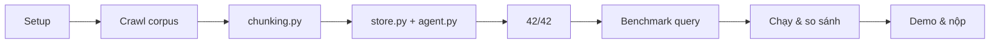

> **4 giờ, 5 giai đoạn.** Mốc thời gian bên dưới tính **tương đối từ lúc lớp bắt đầu** (0:00), không phải giờ tuyệt đối — lớp bắt đầu lúc nào thì cộng dồn từ đó. Lab đan xen phần **cá nhân** (60 điểm — bạn tự code) và phần **nhóm** (40 điểm — mỗi người thử một chiến lược khác nhau trên cùng dữ liệu).
>
> 42 bài test chạy bằng embedding giả lập nên **không cần API key** để pass phần code. Phần dữ liệu thì cần Internet.

## 1. Lộ trình, checkpoint và deliverable

### Lộ trình

| Giai đoạn | Thời gian | Nội dung | Checkpoint |
| --- | --- | --- | --- |
| **1. Dữ liệu** 🟦 | 0:00–1:00 | Setup, chọn chủ đề, crawl corpus | **CP1** 0:20 · **CP2** 1:00 |
| **2. Code cá nhân** 🟩 | 1:00–2:30 | Warm-up + hoàn thiện `src/` | **CP3** 1:45 · **CP4** 2:30 |
| **3. Chiến lược** | 2:30–3:00 | 5 benchmark query + chiến lược riêng | **CP5** 3:00 |
| **4. So sánh** 🟦 | 3:00–3:25 | Chạy benchmark, so sánh, phân tích lỗi | **CP6** 3:25 |
| **5. Demo & nộp** 🟦 | 3:25–4:00 | Thuyết trình, hoàn thiện báo cáo, push | **CP7** 4:00 |


### Deliverable

| # | Nộp gì | Ai | Điểm |
| --- | --- | --- | --- |
| 1 | `src/` hoàn thiện, `pytest tests/ -v` → 42 passed | Mỗi người | 30 |
| 2 | `data/<chu-de>/` — 5–10 tài liệu `.md` + `sources.csv` | Nhóm | 10 |
| 3 | `bench.py` + `ket_qua_benchmark.txt` | Mỗi người | nền cho #4, #5 |
| 4 | `report/REPORT_CANHAN.md` | Mỗi người | 60 (gồm #1) |
| 5 | `report/REPORT_NHOM.md` | Nhóm | 40 (gồm #2) |
| 6 | Repo GitHub `K4-DAY07-HoVaTen-MSSV` + link vlearn | Mỗi người | điều kiện chấm |

`REPORT_CANHAN.md` hỏi bạn code thế nào và kết quả riêng của bạn ra sao — mỗi người một bản. `REPORT_NHOM.md` hỏi nhóm chọn tài liệu gì, ai thử chiến lược nào, chiến lược nào thắng — cả nhóm chung một bản. Điền dần theo từng checkpoint, đừng dồn về cuối.



## 2. 🟦 0:00–0:20 · Setup

Repo chuẩn Python 3.11 (xem `.python-version`); 3.10+ vẫn chạy được toàn bộ test, nên máy chưa kịp cài đúng bản 3.11 vẫn tiếp tục được, không cần dừng lại cài lại.

Fork trước khi clone, đừng clone thẳng repo gốc — bạn cần một remote GitHub thuộc tài khoản của mình để cuối buổi push bài nộp (`K4-DAY07-HoVaTen-MSSV`, xem mục 8). Clone thẳng repo gốc sẽ không có quyền push và phải làm lại từ đầu.

📦 **Starter Repositories Bài Lab 07** (Fork về làm bài):

🅰️ Lớp L3A: [VinUni-AI20k/K4-L3A-Data-Foundations](https://github.com/VinUni-AI20k/K4-L3A-Data-Foundations)
🅱️ Lớp L3B: [VinUni-AI20k/K4-L3B-Data-Foundations](https://github.com/VinUni-AI20k/K4-L3B-Data-Foundations)

Fork đúng repo của lớp bạn, clone bản fork về máy, mở trong VS Code.

macOS / Linux:

```bash
python3.11 -m venv .venv
source .venv/bin/activate
pip install -r requirements.txt
```

Windows (PowerShell):

```powershell
py -3.11 -m venv .venv
.venv\Scripts\Activate.ps1
pip install -r requirements.txt
```

Nếu PowerShell chặn script, chạy một lần `Set-ExecutionPolicy -ExecutionPolicy RemoteSigned -Scope CurrentUser`.

`requirements.txt` chỉ có `pytest` và `python-dotenv`. Không cần `chromadb`, `sentence-transformers`, `openai` hay `google-genai` để hoàn thành phần code — phần lõi cài xong trong vài giây, không phải chờ tải model nào.

### ✅ CHECKPOINT 1 — 0:20

```bash
pytest tests/ -v
```

Phải ra **31 failed, 11 passed** trên 42 test, lỗi toàn là `NotImplementedError`. Đó là baseline đúng: 11 test pass là các test kiểm tra cấu trúc project và `FixedSizeChunker` (đã viết sẵn làm ví dụ).

Thấy `ModuleNotFoundError` nghĩa là venv chưa activate hoặc chưa `pip install`. Quá 0:25 chưa xong thì gọi trợ giảng — mọi thứ sau đều phụ thuộc bước này.

## 3. 🟦 0:20–1:00 · Chủ đề, vai trò và crawl dữ liệu

Đọc [`docs/DATA_COLLECTION.md`](docs/DATA_COLLECTION.md) trước khi crawl. Tài liệu đó là chuẩn chấm cho deliverable #2, phần dưới chỉ tóm tắt cách áp dụng.

### Ràng buộc riêng của K4-L3B

Chủ đề bắt buộc của lớp **L3B** là **chính sách đổi trả, bảo hành, hoặc quy định người bán/người mua** trên nền tảng thương mại điện tử. (Lớp song song L3A cùng bài học này crawl chủ đề dịch vụ/quy định đại học — xem [`K4_VARIANT.md`](K4_VARIANT.md).) Ba ràng buộc quyết định cách bạn thu dữ liệu:

1. Mỗi tài liệu phải có `audience` (`buyer` / `seller` / `both`) cùng `source_url`, `retrieved_at`, `document_version`, và ít nhất một trường lọc khác.
2. Trong 5 benchmark query phải có ít nhất một câu **cần** `metadata_filter={"audience": "buyer"}` (hoặc `"seller"`) mới trả lời đúng.
3. Ít nhất một thành viên chunk theo tiêu đề/mục của điều khoản/chính sách gốc.

### Chia vai (5 phút)

Nhóm 3 người, mỗi người một vai. Vai là trách nhiệm điều phối cộng thêm — ai cũng vẫn tự code Giai đoạn 2 và tự chạy benchmark riêng.

| Vai | Việc | Hạn |
| --- | --- | --- |
| **R1 · Data** | Chốt chủ đề, chia mỗi người 2–3 URL, kiểm metadata từng file, giữ `sources.csv` | CP2 |
| **R2 · Benchmark** | Viết 5 query + gold answer, tự kiểm mỗi gold answer trích được từ tài liệu thật | CP5 |
| **R3 · Strategy** | Bảo đảm không ai trùng chiến lược, nhận vai chunk theo heading, chạy baseline cho nhóm | CP5 |

Nhóm 4 người: người thứ tư làm **Report & Demo Lead**, gom kết quả cả nhóm và dẫn phần thuyết trình.

Chiến lược chunking không được trùng nhau. Gợi ý cho nhóm 3: một người `FixedSizeChunker` (có overlap), một người `RecursiveChunker`, một người viết chunker theo heading — vai thứ ba là bắt buộc.

### Crawl (30 phút)

Repo có sẵn crawler `scripts/fetch_public_pages.py`. Nó kiểm `robots.txt`, giãn cách ≥1 giây giữa các request, chỉ nhận HTML/text, và tự sinh `sources.csv`.

```bash
cp scripts/urls.example.csv data/urls.csv
# điền 5-10 URL vào data/urls.csv
python scripts/fetch_public_pages.py data/urls.csv --output-dir data/<ten-chu-de>
```

Cột bắt buộc trong `data/urls.csv` là `url`. Các cột `doc_id`, `title`, `audience`, `category`, `language`, `document_version`, `license_or_permission` sẽ được đưa thẳng vào frontmatter của file `.md` sinh ra.

Bốn thứ gần như chắc chắn xảy ra, chuẩn bị tinh thần trước:

**Trang bị robots.txt cấm.** Script sẽ báo `disallowed by robots.txt` và bỏ qua. Đây không phải lỗi cần vượt qua — **trang mở công khai với người đọc không đồng nghĩa cho phép truy cập tự động**. Đổi nguồn khác. Nếu bạn đã lỡ tải nó bằng công cụ khác, xoá khỏi corpus.

**Trang render bằng JavaScript** trả về body rỗng, script báo `extracted content is too short`. Đổi nguồn, đừng cố.

**Script crash giữa chừng** với `LookupError: unknown encoding: ...`. Đây là bug đã biết: server trả charset không hợp lệ (ví dụ `charset=utf-8,gbk`), và `LookupError` không nằm trong danh sách bắt lỗi của script nên một URL hỏng làm sập cả lượt chạy. Bỏ URL đó ra khỏi CSV, chạy tiếp, xử lý riêng nó sau.

**Output thô rất bẩn.** Script giữ nguyên menu, banner khuyến mãi, danh sách sản phẩm không liên quan — một trang 3 KB nội dung có thể ra file 16 KB. `docs/DATA_COLLECTION.md` mục 2 yêu cầu bạn **làm sạch trước khi lưu**. Xoá phần thừa bằng tay, giữ lại đúng điều khoản, con số và mốc thời gian. Đừng chunk trên bản thô — nhiễu sẽ chiếm hết top-k.

Đọc lại từng file sau khi làm sạch. Đừng tin output tự động: công cụ fetch có thể tự dịch nội dung sang tiếng Anh mà bạn không để ý.

### Metadata phải khớp với chiều bạn định lọc

Giả sử trang chính sách đổi trả gộp cả thời hạn cho người mua (7 ngày) lẫn thời hạn xử lý cho người bán (30 ngày) trong **một** trang. Nếu bạn lưu thành một file `audience: both`, thì `metadata_filter={"audience":"buyer"}` **không lọc được gì** — hai đáp án nằm chung một tài liệu. Metadata schema đẹp trên giấy nhưng vô dụng khi chạy.

Cách xử lý: tách thành hai file, mỗi file một `audience`. Lúc đó filter mới có việc thật, và bạn sẽ có số liệu A/B để viết vào báo cáo.

Với `document_version`, chỉ ghi số hiệu khi trang nguồn thực sự nêu. Không có thì ghi `not-stated` — **không bịa số hiệu**.

### ✅ CHECKPOINT 2 — 1:00

Chạy script kiểm tra theo checklist mục 6 của `docs/DATA_COLLECTION.md`, mọi dòng phải `OK`:

```bash
python -c "
import csv, re
from pathlib import Path
D = Path('data/<ten-chu-de>')
REQ = ['doc_id','title','source_url','retrieved_at','document_version','audience']
mds = sorted(D.glob('*.md'))
rows = list(csv.DictReader(open(D/'sources.csv', encoding='utf-8')))
ids, auds = [], {}
for p in mds:
    fm = dict(re.findall(r'^(\w+):\s*(.+)\$', p.read_text(encoding='utf-8').split('---')[1], re.M))
    ids.append(fm.get('doc_id'))
    auds[fm.get('audience')] = auds.get(fm.get('audience'), 0) + 1
    print(f'{p.name:40} {\"OK\" if all(k in fm for k in REQ) and fm.get(\"doc_id\")==p.stem else \"THIEU METADATA\"}')
print('so file :', len(mds), '(can 5-10)')
print('csv     :', 'khop' if sorted(r['doc_id'] for r in rows)==sorted(ids) else 'LECH')
print('audience:', auds)
"
```

Cần đạt: **5–10 file**, mọi file đủ metadata, `sources.csv` khớp 1-1, và `audience` có **ít nhất 2 giá trị khác nhau** (nếu chỉ một giá trị thì filter không có gì để lọc).

Điền luôn bảng Data Inventory và Metadata Schema vào **REPORT_NHOM mục 1** — số liệu đang ở ngay trước mặt bạn.

Chậm tiến độ thì lấy đủ 5 tài liệu rồi sang Giai đoạn 2 đúng giờ. Rubric chấm chất lượng và tính minh bạch nguồn, không chấm số lượng.

## 4. 🟩 1:00–1:45 · Warm-up và `chunking.py`

Từ đây là 90 phút cá nhân. Không chia code cho nhau.

### Warm-up (10 phút) → REPORT_CANHAN mục 1

Hai câu hỏi, 5 điểm, làm nhanh rồi vào code.

**Cosine similarity.** Giải thích similarity cao nghĩa là gì; cho một cặp câu tương đồng cao và một cặp thấp; nói vì sao cosine hợp với text embedding hơn khoảng cách Euclid. Gợi ý cho cặp "cao": chọn hai câu **khác từ vựng nhưng cùng nghĩa** — như vậy mới chứng minh embedding hiểu nghĩa chứ không so khớp từ.

**Bài toán chunking.** Tài liệu 10.000 ký tự, `chunk_size=500`, `overlap=50` thì ra bao nhiêu chunk? Công thức trong `exercises.md` là `ceil((độ_dài − overlap) / (chunk_size − overlap))`. Tính xong thì kiểm lại bằng chính `FixedSizeChunker` có sẵn trong repo thay vì tin công thức suông:

```bash
python -c "
from src.chunking import FixedSizeChunker
print(len(FixedSizeChunker(chunk_size=500, overlap=50).chunk('a'*10000)))
"
```

Rồi trả lời: overlap tăng lên 100 thì số chunk đổi thế nào, và vì sao đôi khi bạn muốn overlap lớn hơn dù nó tốn thêm chunk.

### Luồng dữ liệu

```
File .md → Chunker.chunk() → list[str] → Document(id, content, metadata)
                                              ↓
                    EmbeddingStore.add_documents() → search() → top_k
                                              ↓
                              KnowledgeBaseAgent.answer() → llm_fn()
```

Ba điều hay bị hiểu sai:

**`add_documents` không tự chunk.** Test đưa vào 3 `Document` và mong `get_collection_size() == 3`, tức 1 `Document` = 1 record. Việc chunking do bạn làm ở tầng ngoài (CP5), mỗi chunk thành một `Document` riêng.

**`MockEmbedder` không có ngữ nghĩa** — nó băm MD5 rồi sinh số giả ngẫu nhiên. Đủ dùng cho pytest vì test chỉ kiểm cấu trúc, nhưng sẽ phá hỏng benchmark ở Giai đoạn 4.

**Vector đã được chuẩn hoá** (`||v|| = 1`), nên dot product bằng đúng cosine. Đó là lý do docstring của `search` cho phép dùng dot product cho gọn.

Giữ nguyên mọi dòng `def ...` — test kiểm tra theo chữ ký hàm. Chỉ thay phần `TODO` và `raise NotImplementedError`.

### `SentenceChunker.chunk`

Tách câu theo `". "`, `"! "`, `"? "`, `".\n"`, gom `max_sentences_per_chunk` câu thành một chunk, strip khoảng trắng thừa. Text rỗng trả `[]`, không được crash.

Cái bẫy nằm ở regex. Nếu bạn split bằng `[.!?]\s+` thì dấu câu **bị nuốt mất** và mọi chunk thành câu cụt. Tìm cách tách ở vị trí *sau* dấu câu mà vẫn giữ được nó — `re` có cú pháp cho việc này.

Ghi vào báo cáo edge case bạn biết là mình chưa xử lý được: chữ viết tắt (`TS.`, `v.v.`) và số thập phân sẽ bị cắt sai. Nêu ra được đánh giá cao hơn giấu đi.

### `RecursiveChunker.chunk` và `_split`

Thử separator theo thứ tự ưu tiên `["\n\n", "\n", ". ", " ", ""]`: cắt bằng ranh giới "to" trước để giữ ngữ nghĩa, chỉ khi mảnh vẫn quá dài mới hạ xuống separator nhỏ hơn.

Thuật toán có **hai chiều**, và người ta thường chỉ viết một:

- *Đệ quy xuống sâu:* mảnh nào vẫn dài hơn `chunk_size` thì gọi lại `_split` với danh sách separator còn lại.
- *Gom lên:* các mảnh nhỏ liền kề phải được nối lại cho tới sát `chunk_size`. Thiếu bước này, một file nhiều dòng ngắn sẽ sinh ra hàng trăm chunk vụn 5–10 ký tự và retrieval sẽ rất tệ.

Nghĩ kỹ base case. Có ba trường hợp dừng, và test `test_empty_separators_falls_back_gracefully` truyền thẳng `separators=[]` — thiếu nhánh xử lý đó là fail.

### `compute_similarity`

Công thức nằm trong docstring. Việc duy nhất phải nghĩ thêm là vector độ dài 0: phải trả `0.0` chứ không được để `ZeroDivisionError`. Hàm `_dot` đã có sẵn phía trên, tái sử dụng nó.

### `ChunkingStrategyComparator.compare`

Gọi cả ba chunker trên cùng text, trả dict có đúng ba key `fixed_size`, `by_sentences`, `recursive`; mỗi key là dict có `count`, `avg_length`, `chunks`. Test đọc theo tên chính xác nên gõ sai một ký tự là fail.

Nhớ chặn chia cho 0 khi text rỗng.

### ✅ CHECKPOINT 3 — 1:45

```bash
pytest tests/ -k "Chunker or Similarity or Compare" -v
```

Kỳ vọng **23 passed** — gồm 7 test `FixedSizeChunker` có sẵn cộng 16 test của phần bạn vừa viết.

Chậm tiến độ thì ưu tiên `SentenceChunker` (comparator cần nó) và `compute_similarity` (ngắn), để `RecursiveChunker` lại sau — `EmbeddingStore` ở bước tiếp mới là phần nhiều test nhất.

## 5. 🟩 1:45–2:30 · `store.py` và `agent.py`

### `EmbeddingStore` — 5 method, 14 test

Làm hai helper trước, bốn method công khai sau. Làm ngược lại bạn sẽ viết lặp cùng một logic bốn lần.

**Về ChromaDB:** bỏ hẳn nhánh Chroma, chỉ dùng in-memory. Không test nào cần nó, `requirements.txt` không cài nó, và code khởi tạo sẵn có một cái bẫy — `self._use_chroma = True` được gán *trước* khi client được tạo. Nếu máy chấm bài tình cờ có `chromadb`, mọi method sẽ rẽ vào nhánh chưa cài đặt và cả 14 test sập.

**`_make_record`** chuẩn hoá một `Document` thành record lưu trong store. Hai chi tiết đáng nghĩ: copy metadata thay vì dùng trực tiếp object của người gọi, và bảo đảm record luôn có khoá `doc_id` trong metadata — `delete_document` phụ thuộc vào nó. Ở CP5 bạn sẽ tạo nhiều `Document` từ một file với id kiểu `"file#0"`, `"file#1"`, nên `doc_id` phải trỏ về **file gốc** chứ không phải id của chunk.

**`_search_records`** chạy similarity search trên một tập record bất kỳ. Tách riêng nó ra vì `search()` và `search_with_filter()` chỉ khác nhau ở *tập ứng viên đầu vào*; cho cả hai đi qua cùng một đường code thì không thể lệch kết quả, và test `test_no_filter_returns_all_candidates` pass hiển nhiên. Kết quả trả về nên bỏ `embedding` đi — vector 1536 chiều làm bẩn output khi in ra terminal.

**`search_with_filter`** phải lọc **trước** rồi mới search. Nếu lấy top-k rồi mới bỏ cái không khớp, bạn có thể còn lại 0 kết quả dù store vẫn còn tài liệu hợp lệ — k slot đã bị chiếm hết bởi tài liệu sai. Báo cáo hỏi thẳng câu này, chuẩn bị sẵn câu trả lời.

**`delete_document`** xoá mọi chunk có `metadata['doc_id']` khớp, trả `True`/`False` tuỳ có xoá được gì không.

### `KnowledgeBaseAgent.answer`

Ba nhịp: truy xuất top-k → dựng prompt có ngữ cảnh → gọi `llm_fn`.

Phần đáng đầu tư là cách dựng ngữ cảnh. Đánh số từng chunk `[1] [2] [3]` kèm nguồn, rồi yêu cầu model trích dẫn số đó khi trả lời — như vậy câu trả lời **truy vết được** về đúng chunk và đúng file. Đây là tiêu chí *Source Traceability* trong `docs/EVALUATION.md`, và với corpus quy định thì nó không phải tính năng phụ.

Thêm ràng buộc chống bịa: chỉ dùng ngữ cảnh được cung cấp, không có thì nói rõ là không tìm thấy. Và xử lý trường hợp store rỗng — trả câu thông báo, đừng crash và đừng gọi LLM vô ích.

### ✅ CHECKPOINT 4 — 2:30 · mốc quan trọng nhất

```bash
pytest tests/ -v
python main.py "Chunking là gì?"
```

Phải ra **42 passed**, và `main.py` chạy được từ đầu đến cuối. Dòng `Skipping missing file: data/customer_support_playbook.txt` là bình thường — repo không có file đó.

Chụp output `pytest tests/ -v` dán vào **REPORT_CANHAN mục 3** (30 điểm).

Còn test đỏ thì sửa song song trong lúc nhóm chốt benchmark query, nhưng đừng để trễ quá 3:00 — CP5 cần `src/` chạy được.

## 6. 2:30–3:00 · Chiến lược riêng và benchmark

Hai luồng chạy song song: R2 viết câu hỏi, mọi người dựng `bench.py`.

### 5 benchmark query (R2 chủ trì)

Đúng 5 câu, đa dạng về dạng hỏi (tra số liệu, hỏi điều kiện, hỏi quy trình, liệt kê). Mỗi câu có gold answer **trích được từ tài liệu**, không suy đoán chính sách của nền tảng. Cả nhóm dùng chung 5 câu này.

Ít nhất một câu phải **cần** `metadata_filter={"audience": "buyer"}` (hoặc `"seller"`). Cách làm câu này hiệu quả: chọn một câu hỏi **không nêu rõ người hỏi là ai**, trong khi corpus có hai tài liệu cùng chủ đề, cùng từ vựng, nhưng khác đối tượng và khác đáp án. Không lọc thì retrieval sẽ lẫn hai tài liệu và agent trả lời sai đối tượng — đúng thứ bạn cần chứng minh.

### Baseline (R3 chủ trì)

Chạy `ChunkingStrategyComparator().compare()` trên 2–3 tài liệu, điền bảng Baseline Analysis vào REPORT_NHOM mục 2. Nhớ bỏ frontmatter trước khi so sánh, nếu không bạn đang đo cả khối YAML.

### Chunker theo heading (R3)

Văn bản quy định được biên soạn theo mục (`## Điều 4 — ...`), mỗi mục đã là một đơn vị ngữ nghĩa trọn vẹn do người soạn chia sẵn. Ý tưởng: tách trước mỗi dòng heading, mỗi section thành một chunk, section nào dài quá ngưỡng thì hạ xuống recursive.

Một chi tiết dễ bỏ sót: khi phải cắt nhỏ một section dài, **gắn lại tiêu đề vào từng mảnh con**. Không có nó, mảnh thứ hai trở đi mất ngữ cảnh "đây là mục nói về cái gì".

### `bench.py`

Đây là công cụ đo của riêng bạn, không phải bài tập được chấm bằng test. Nó cần làm bốn việc:

```python
# 1. Đọc từng file .md, tách frontmatter thành metadata và phần thân thành content
# 2. Chunk phần thân, mỗi chunk thành một Document:
#       Document(id=f"{path.stem}#{i}", content=chunk,
#                metadata={**frontmatter, "doc_id": path.stem, ...})
# 3. Nạp vào EmbeddingStore, chạy 5 query qua search_with_filter()
# 4. In top-3 kèm score và doc_id để đối chiếu với gold answer
```

Bốn chỗ dễ sai:

- Chunking phải xảy ra **ngoài** store. Nạp cả file làm một `Document` như `main.py` thì retrieval trả về nguyên file, vô dụng.
- `doc_id` trong metadata trỏ về **tên file gốc**, còn `Document.id` mới là `"file#0"`.
- Metadata frontmatter phải được trải vào **mọi** chunk, nếu không `search_with_filter` không có gì để lọc.
- Mỗi người chỉ đổi **một dòng** — dòng chọn chunker — sang chiến lược của mình. Mọi thứ khác giữ nguyên để so sánh mới công bằng.

Nếu dùng OpenAI embedding, thêm cache theo hash nội dung để chạy lại không tốn thêm tiền.

### ✅ CHECKPOINT 5 — 3:00

`python bench.py` chạy được, in ra số chunk đã nạp và kết quả top-3 cho cả 5 câu. Nhóm có đủ 5 query kèm gold answer trong REPORT_NHOM mục 3, và mỗi người đã đổi sang chiến lược riêng.

Chưa cần quan tâm kết quả tốt hay xấu — CP6 mới xét chất lượng.

## 7. 🟦 3:00–3:25 · Chạy, so sánh và phân tích lỗi

### Chọn embedding backend trước khi đo

`MockEmbedder` băm MD5 chuỗi ký tự nên **không mã hoá ngữ nghĩa**. Chạy benchmark bằng nó thì mọi số liệu là nhiễu: một câu hỏi về đổi trả có thể trả về top-1 là tài liệu chính sách bảo hành, còn chunk đúng xếp hạng ba với score âm.

Nếu máy và mạng cho phép, bật embedder thật (Phụ lục B) — nên cài từ đầu buổi để tải nền trong lúc code. Nếu buộc phải dùng mock, vẫn làm được bài, nhưng phải **ghi rõ trong báo cáo** rằng số liệu bị chi phối bởi mock, và chuyển trọng tâm phân tích sang `count` / `avg_length` / độ mạch lạc của chunk — những chỉ số không phụ thuộc embedding.

### Chấm hai mức, không chỉ một

Cách chấm ngây thơ là kiểm `doc_id` của tài liệu gold có nằm trong top-3 không. Cách đó **thổi phồng kết quả**.

Một chiến lược hoàn toàn có thể lấy trọn cả ba slot top-3 từ đúng tài liệu gold mà **không chunk nào chứa câu trả lời** — chuyện này hay xảy ra với chunker theo heading, vì các section trong cùng một tài liệu nói về cùng chủ đề nên điểm gần bằng nhau và việc section nào lọt top-3 gần như ngẫu nhiên.

`docs/SCORING.md` yêu cầu *top-3 có chunk liên quan **và** agent trả lời đúng*, nên phải kiểm ở mức nội dung: khai báo cho mỗi câu hỏi một chuỗi đặc trưng phải xuất hiện trong ngữ cảnh truy xuất được, rồi kiểm chuỗi đó có thật không. Chênh lệch giữa hai cách chấm chính là phát hiện đáng giá nhất của buổi lab.

Thang điểm: 2đ nếu gold ở top-1 và ngữ cảnh chứa đáp án, 1đ nếu gold ở top-2/3, 0đ nếu vắng hoặc ngữ cảnh không trả lời được.

### A/B bắt buộc

Chạy câu cần filter hai lần — một lần có `metadata_filter`, một lần không — trên cả ba chiến lược. Ghi lại top-3 của từng lần. Đây là bằng chứng cho câu hỏi "metadata filter có giúp ích không" trong REPORT_NHOM mục 3.

Nếu kết quả hai lần giống hệt nhau thì câu hỏi của bạn **chưa thực sự cần filter** — quay lại sửa câu hỏi hoặc sửa cách tách tài liệu theo `audience`.

### Phân tích lỗi

Tìm ít nhất một failure case thật, viết đủ ba phần: câu hỏi nào hỏng, vì sao, đề xuất sửa. Vài hướng thường gặp:

- Chunk đúng chủ đề nhưng **không chứa số liệu** thắng chunk có đáp án — cosine đo độ giống chủ đề, không đo mật độ thông tin trả lời được.
- Top-3 đúng tài liệu nhưng sai section — chunk không có overlap nên mỗi thông tin chỉ có đúng một cơ hội lọt top-k.
- Filter `audience` cứng loại nhầm tài liệu chứa thông tin cần — đánh đổi giữa precision và recall.

### ✅ CHECKPOINT 6 — 3:25

Mỗi người có `ket_qua_benchmark.txt` của riêng mình và đã điền bảng top-3 vào **REPORT_CANHAN mục 5**. Nhóm có bảng so sánh giữa các thành viên và ít nhất một failure case trong **REPORT_NHOM mục 2 và 4**.

## 8. 🟦 3:25–4:00 · Demo và nộp bài

### Demo 6–8 phút

Mọi thành viên đều phải nói phần chiến lược của mình. Thứ tự gợi ý: chủ đề và bộ tài liệu (1'), mỗi người tóm tắt chiến lược (2'), so sánh và giải thích chiến lược nào thắng (3'), demo trực tiếp 1–2 câu (2'), hỏi đáp.

Mở sẵn terminal với `bench.py` đã chạy được. Demo live mà phải debug tại chỗ là mất điểm.

Ba câu giảng viên hay hỏi: chuyển sang chủ đề khác thì chiến lược nào còn dùng được; metadata filter giúp ở đâu và làm mất kết quả ở đâu; nhóm học được gì từ nhóm khác.

Nhóm chưa tới lượt thì tranh thủ hoàn thiện báo cáo.

### Nộp bài

K4-L3B nộp **link repo GitHub** trên vlearn, không nộp zip.

```bash
pytest tests/ -v          # phải 42 passed
git status                # không được thấy .venv/ hay .env

git add .
git commit -m "Nộp bài Lab 07"
git branch -M main
git remote add origin https://github.com/<tài-khoản>/K4-DAY07-<HoVaTen>-<MSSV>.git
git push -u origin main
```

Tên repo theo quy ước `K4-DAY07-HoVaTen-MSSV`, họ tên viết liền không dấu. Nếu bạn đã fork repo gốc thì đổi tên fork trong Settings thay vì tạo repo mới.

Cấu trúc khi nộp:

```
K4-DAY07-NguyenVanAn-21001234/
├── src/                      # đã hoàn thiện mọi TODO
├── data/<ten-chu-de>/        # 5-10 tài liệu + sources.csv
├── report/
│   ├── REPORT_CANHAN.md      # bản của riêng bạn
│   └── REPORT_NHOM.md        # bản chung của nhóm
├── bench.py
├── ket_qua_benchmark.txt
└── tests/, main.py, ...      # giữ nguyên
```

### ✅ CHECKPOINT 7 — 4:00

- [ ] `pytest tests/ -v` → 42 passed, không còn `raise NotImplementedError`
- [ ] `data/<chu-de>/` có 5–10 tài liệu đủ metadata, `sources.csv` khớp 1-1
- [ ] Có ít nhất 1 query dùng `metadata_filter={"audience": "buyer"}` (hoặc `"seller"`)
- [ ] Ít nhất 1 thành viên chunk theo heading/section
- [ ] Hai báo cáo điền đủ, output pytest là thật
- [ ] `bench.py` + `ket_qua_benchmark.txt` đã commit
- [ ] Repo đúng tên quy ước, không chứa `.venv/`/`.env`, đã nộp link vào vlearn

Chọn rating và dán link bài nộp bên dưới, rồi bấm **Xác nhận đã nộp bài**.

## 9. Phụ lục A — Lỗi thường gặp

| Triệu chứng | Nguyên nhân | Cách sửa |
| --- | --- | --- |
| `ModuleNotFoundError: No module named 'src'` | Chạy python từ thư mục khác | `cd` về thư mục gốc repo |
| Test store fail dù code trông đúng | `_use_chroma = True` nhưng nhánh Chroma chưa cài đặt | Set `False`, chỉ dùng in-memory |
| `test_no_filter_returns_all_candidates` fail | `search` và `search_with_filter` dùng hai đường code khác nhau | Cho cả hai gọi chung `_search_records` |
| `delete_document` luôn trả `False` | Record không có `metadata['doc_id']` | Set `doc_id` trong `_make_record` |
| `test_empty_separators_falls_back_gracefully` fail | Thiếu base case cho `separators == []` | Thêm nhánh cắt cứng theo `chunk_size` |
| `ZeroDivisionError` trong `compare` | Chia cho `count == 0` khi text rỗng | Chặn trước khi chia |
| Chunk vụn 5–10 ký tự | `RecursiveChunker` thiếu bước gom | Nối các mảnh nhỏ liền kề tới sát `chunk_size` |
| `KeyError` khi đọc kết quả comparator | Tên key gõ sai | So từng ký tự với docstring |
| Crawler báo `disallowed by robots.txt` | Nguồn không cho truy cập tự động | Đổi nguồn — không phải lỗi cần vượt qua |
| Crawler crash `LookupError: unknown encoding` | Server trả charset không hợp lệ | Bỏ URL đó khỏi CSV, xử lý riêng |
| `search_with_filter` luôn trả rỗng | Metadata không được trải vào từng chunk | Gộp frontmatter vào metadata khi tạo `Document` |
| Filter không đổi kết quả gì | Corpus chỉ có một giá trị `audience`, hoặc hai đáp án nằm chung một file | Tách file theo `audience` |
| Score âm cho chunk đúng | Đang dùng `MockEmbedder` | Bật embedder thật (Phụ lục B) |

## 10. Phụ lục B — Bật embedder thật

Không ảnh hưởng 30 điểm code (42 test đều dùng mock), chỉ ảnh hưởng chất lượng số liệu ở Giai đoạn 3–4. Lần cài đầu tải khá lâu — chạy từ đầu buổi để tải nền.

**Local, đa ngữ, miễn phí** (hợp corpus tiếng Việt):

```bash
pip install -r requirements-local.txt
```

rồi thêm `EMBEDDING_PROVIDER=local` vào `.env`.

**OpenAI:**

```bash
pip install openai
```

rồi thêm vào `.env`:

```bash
EMBEDDING_PROVIDER=openai
OPENAI_API_KEY=sk-...
OPENAI_EMBEDDING_MODEL=text-embedding-3-small
```

**Gemini (Google) — không có OpenAI key thì dùng cái này:**

Gemini API key lấy miễn phí tại [aistudio.google.com/apikey](https://aistudio.google.com/apikey), không cần thẻ thanh toán.

```bash
pip install google-genai
```

rồi thêm vào `.env`:

```bash
EMBEDDING_PROVIDER=gemini
GEMINI_API_KEY=...
GEMINI_EMBEDDING_MODEL=gemini-embedding-001
```

Không chọn gì thì lab dùng mock. Chọn `local`, `openai`, hoặc `gemini` mà thiếu thư viện hoặc key thì code tự quay về mock chứ không crash — kiểm dòng `Embedding backend: ...` mà `main.py` in ra để biết mình đang chạy backend nào.

`.env` đã nằm trong `.gitignore`. Kiểm lại repo trên GitHub sau khi push, đừng để lộ key.
